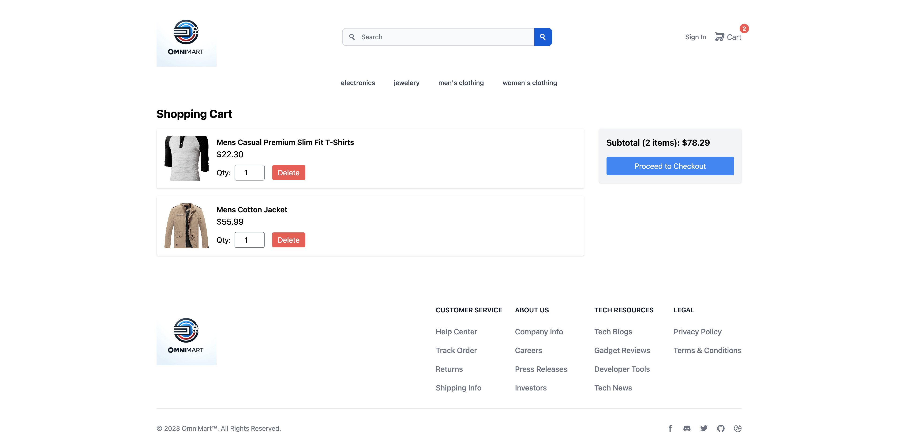

# E-commerce Store

## Description

Welcome to the OmniMart, a frontend project built using Vite and React, focusing on a verity of products. This project showcases a responsive and modern e-commerce website with a clean and intuitive user interface.

## Table of Contents

- [Features](#features)
- [Technologies](#technologies)
- [Usage](#usage)

Home:

Cart:

Checkout:

## Features

- Home page with featured products
- Product listings
- Product details
- Shopping cart functionality
- Responsive design for various devices
- Modern and clean UI with Flowbite Tailwind

## Technologies

- Frontend: Vite-React
- Flowbite Tailwind

## Usage

- To see the app please follow the following link:
  [AppDemo](https://famous-strudel-8dda8e.netlify.app/)

## Contact

Gilbert Espinoza

- Website - https://gilbertespinoza.dev/
- Email - Gilbertepsinoza9922@gmail.com
- Linkedin - www.linkedin.com/in/gilbertoespinoza1
